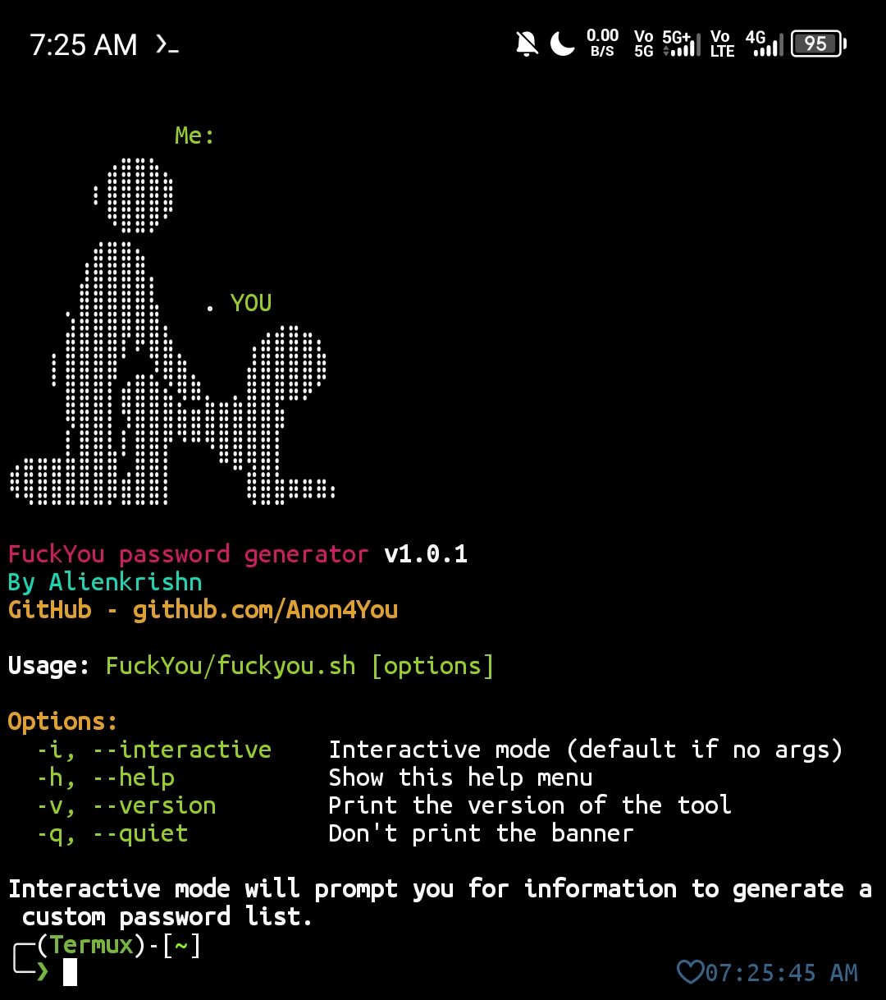

# 🔐 FuckYou Password Generator 🔐



A **powerful** and **customizable** password list generator written in Bash. Create targeted wordlists for security testing with personal information patterns commonly used in weak passwords.

---

## 🚀 Features

- ✨ **Interactive mode** with intuitive prompts
- 🎨 **Colorful UI** with ANSI colors for better UX
- 🔢 **Multiple generation options**:
  - Leet speak (1337) transformations
  - Special character suffixes
  - Random number combinations
- 📊 **Real-time progress indicator**
- 📁 **Auto-saves** in current directory
- 🛠 **Highly customizable** based on target information

## 📦 Installation

```bash
git clone https://github.com/Anon4You/FuckYou.git
cd FuckYou
chmod +x fuckyou.sh
```

## 🖥 Usage

```bash
./fuckyou.sh [options]
```

### Options:
| Flag | Description |
|------|-------------|
| `-i`, `--interactive` | Interactive mode (default) |
| `-h`, `--help` | Show help menu |
| `-v`, `--version` | Show version info |
| `-q`, `--quiet` | Run without banner |

## 🧠 How It Works

The script collects:
- Personal info (name, birthday, nickname)
- Family member details
- Pet and company information
- Custom keywords

Then generates combinations using:
- Basic concatenations
- Common number patterns
- Leet speak substitutions
- Special character additions

## 📝 Example

```bash
$ ./fuckyou.sh -i
[Interactive mode launches...]
Enter your first name: John
Enter your surname: Doe
...
Wordlist generated successfully: /path/to/John_wordlist.txt
Total passwords generated: 5248
```

## ⚠ Disclaimer

❗ **This tool is for legal security testing and educational purposes only.**  
❗ **Never use this tool against systems you don't own or have permission to test.**  
❗ **The creator assumes no liability for misuse of this tool.**

## 📜 License

MIT License - See [LICENSE](LICENSE) file

---

💻 **Author**: [Alienkrishn](https://github.com/Anon4You)  
🐛 **Report Issues**: [GitHub Issues](https://github.com/Anon4You/FuckYou/issues)  
🌟 **Like this project?** Give it a star!

